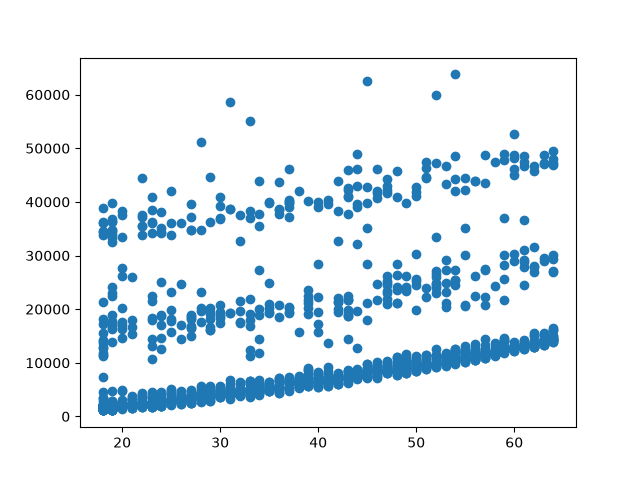
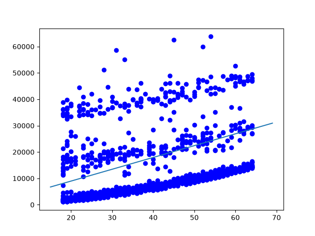

# linear-regression-from-scratch
Implementing linear regression to Datasets from scratch. (No Scikit-Learn)

## Dataset

The model uses the **Medical Cost Dataset** (`data.csv`):
- **Input Feature ($x$):** `age` (Age of the individual)
- **Target Variable ($y$):** `charges` (Medical insurance cost)

We want to find the best-fitting line that predicts insurance charges based on a person's age.




## 1. Hypothesis Function (The Line)

We model the relationship between $x$ and $y$ as a straight line:

$$y = m \cdot x + b$$

- $m$ = Slope (how much charges increase per year of age)
- $b$ = Intercept (base charge when age is 0)

```python
def predict(x, m, b):
    return m * x + b
```


## 2. Loss Function (Mean Squared Error)

To measure how well our line fits the data, we calculate the average squared difference between the actual values ($y_i$) and the predicted values ($\hat{y}_i = m \cdot x_i + b$):

$$E = \frac{1}{n} \sum_{i=1}^{n} \left( y_i - (m \cdot x_i + b) \right)^2$$

- Lower error ($E$) means a better-fitting line.

```python
def loss_function(m, b, points):
    total_error = 0
    n = len(points)
    for i in range(n):
        x = points.iloc[i].age
        y = points.iloc[i].charges
        total_error += (y - (m * x + b)) ** 2
    return total_error / float(n)
```

## 3. Gradients (Direction to Move)

To minimize the error, we find the partial derivatives with respect to $m$ and $b$. These derivatives tell us the slope of the error surface and the direction to adjust our parameters:

$$\frac{\partial E}{\partial m} = -\frac{2}{n} \sum_{i=1}^{n} x_i \left( y_i - (m \cdot x_i + b) \right)$$

$$\frac{\partial E}{\partial b} = -\frac{2}{n} \sum_{i=1}^{n} \left( y_i - (m \cdot x_i + b) \right)$$


## 4. Gradient Descent (Updating Parameters)

We adjust $m$ and $b$ in the opposite direction of the gradient to step downhill towards the minimum error:

$$m = m - L \cdot \frac{\partial E}{\partial m}$$

$$b = b - L \cdot \frac{\partial E}{\partial b}$$

- **Learning Rate ($L$):** Controls the step size. If $L$ is too large, it overshoots; if too small, learning takes too long.

```python
def gradient_descent(m_now, b_now, points, L):
    m_gradient = 0
    b_gradient = 0
    n = len(points)
    
    for i in range(n):
        x = points.iloc[i].age
        y = points.iloc[i].charges
        
        m_gradient += -(2 / n) * x * (y - (m_now * x + b_now))
        b_gradient += -(2 / n) * (y - (m_now * x + b_now))
        
    m_now = m_now - (L * m_gradient)
    b_now = b_now - (L * b_gradient)
    
    return m_now, b_now
```


## 5. Complete Training Script

```python
import pandas as pd
import matplotlib.pyplot as plt

# Load dataset
data = pd.read_csv("data.csv")

# Initialize parameters
m = 0
b = 0
L = 0.0001
epochs = 500

# Training loop
for i in range(epochs):
    m, b = gradient_descent(m, b, data, L)

print(f"Trained Parameters: m = {m:.4f}, b = {b:.4f}")

# Plot results
plt.scatter(data.age, data.charges, color="blue", alpha=0.5, label="Actual Data")
plt.plot(range(18, 65), [m * x + b for x in range(18, 65)], color="red", label="Fitted Line")
plt.xlabel("Age")
plt.ylabel("Charges")
plt.legend()
plt.show()
```


